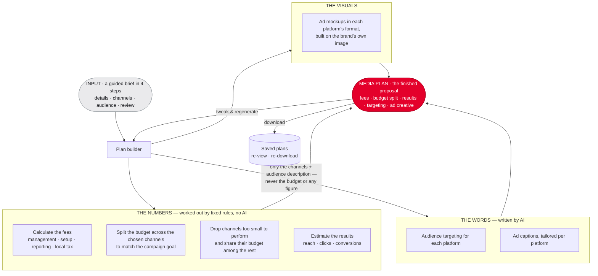

# Prism — How It Works

A marketer fills in a short brief and gets back a client-ready media plan. Behind
the scenes the work is split into two very different jobs: **the numbers** (all
the money and budget maths) and **the words** (the audience targeting and ad
copy). They're deliberately kept apart — see *Why it's built this way* below.

The diagram reads top to bottom: the **brief goes in at the top**, the **finished
media plan comes out at the bottom** — and can be refined or downloaded.

## The flow

## What each part does

- **Input — the guided brief.** Filled in over four steps: the details (client,
  website, market — Malaysia RM or Singapore S$ — budget, goal, segment,
  duration), the channels to include, the audience description, then a review
  before generating.
- **The Numbers.** Everything involving money. It works out every fee (including
  the right local tax), splits the budget across the chosen channels to fit the
  goal, drops any channel too small to perform (sharing its budget out), and
  estimates the likely results. It runs on fixed, published rules, so every
  figure is exact and can be checked by hand.
- **The Words.** The AI part. It writes the audience targeting and the ad
  captions, tailored to each platform's voice. It only ever sees the channels and
  a plain-English description of the audience — never the budget or any number.
- **The Visuals.** Builds an ad mockup for each channel in its native format,
  composed on the brand's own imagery (pulled from their website) or a branded
  background.
- **Result — the media plan.** Everything assembled into one clean, client-ready
  proposal.

## Refine, save, reuse

- **Refine** — tweak any part of the brief and regenerate; the plan updates while
  keeping your inputs. You can also give the AI a **plain-English instruction**
  ("punchier TikTok copy", "target parents") that steers the targeting and ad
  wording — never the numbers. "New plan" starts fresh instead.
- **Save** — a downloaded proposal is kept in a history you can re-open,
  re-download, or remove.

## Why it's built this way

The money and the creative are kept completely separate. Anything with a number —
fees, the budget split, tax, the estimated results — is calculated by fixed rules,
so every figure is **exact and auditable**. The AI is used only where it genuinely
helps: writing the targeting and the ad wording. **No number ever passes through
the AI**, which is what makes the plan trustworthy.

## How it fits into a workflow

It's a single online tool. A marketer fills in the form and gets a plan back in
seconds. It can also run automatically — a CRM or an intake form can send a brief
in and receive the finished plan back, without anyone opening the tool.
