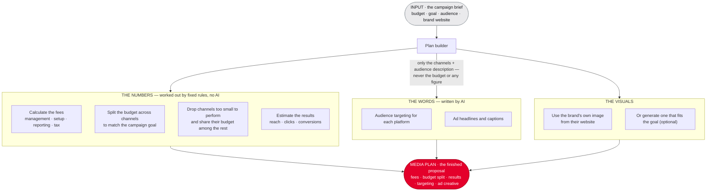

# Prism — How It Works

A marketer fills in a short brief and gets back a client-ready media plan. Behind
the scenes the work is split into two very different jobs: **the numbers** (all
the money and budget maths) and **the words** (the audience targeting and ad
copy). They're deliberately kept apart — see *Why it's built this way* below.

The diagram reads top to bottom: the **brief goes in at the top**, the **finished
media plan comes out at the bottom**.

## The flow

## What each part does

- **Input — the brief** — what the marketer fills in: how much to spend, the goal
  (Awareness, Traffic, or Conversion), who the audience is, and the brand's
  website.
- **The Numbers** — everything involving money. It works out every fee, splits
  the budget across Meta, Google, TikTok and LinkedIn to fit the goal, drops any
  channel too small to perform (and shares its budget out), and estimates the
  likely results. It runs on fixed, published rules, so every figure is exact and
  can be checked by hand.
- **The Words** — the AI part. It writes the audience targeting and the ad copy.
  It only ever sees the channels and a plain-English description of the audience —
  never the budget or any number.
- **The Visuals** — builds the ad mockups on the brand's own imagery (pulled from
  their website), or an image generated to fit the campaign goal.
- **Result — the media plan** — all of the above assembled into one clean,
  client-ready proposal.

## Why it's built this way

The money and the creative are kept completely separate. Anything with a number —
fees, the budget split, tax, the estimated results — is calculated by fixed rules,
so every figure is **exact and auditable**. The AI is used only where it genuinely
helps: writing the targeting and the ad wording. **No number ever passes through
the AI**, which is what makes the plan trustworthy.

## How it fits into a workflow

It's a single online tool. A marketer fills in the form and gets a plan back in
seconds. It can also run automatically — a CRM or an intake form can send a brief
in and receive the finished plan back, without anyone opening the tool.
